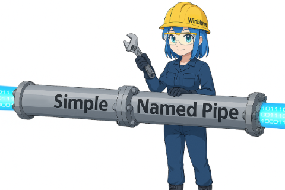

# SimpleNamedPipe


SimpleNamedPipe is a lightweight C++ library for creating and managing asynchronous named pipe servers on Windows.

The project is distributed under the MIT license. See the [LICENSE](LICENSE) file for the full text.

For the documentation in Russian, see [README-RU.md](README-RU.md).

## Features

- asynchronous client handling through IO Completion Port;
- runs either in a separate thread or blocking the current one (the `start()` parameter);
- supports up to 256 simultaneous clients;
- send queue with limits on message size and count;
- event notifications via callbacks or the `ServerEventHandler` class;
- lightweight MQL5 client with optional global callbacks;
- the MQL5 client performs read/write synchronously; call `update()` for polling (e.g., in a timer).

## Quick Start

### Minimal server

```cpp
#include "SimpleNamedPipe/NamedPipeServer.hpp"
using namespace SimpleNamedPipe;

int main() {
    NamedPipeServer server({"ExamplePipe"});

    server.on_message = [&server](int id, const std::string& msg) {
        server.send_to(id, "Echo: " + msg);
    };

    server.start(); // launches the server in a separate thread
    std::cin.get(); // waits for Enter
    server.stop();
}
```

### Minimal MQL5 client

```mql5
#include <SimpleNamedPipe\NamedPipeClient.mqh>

NamedPipeClient pipe;

int OnInit() {
    pipe.open("ExamplePipe");
    EventSetMillisecondTimer(10);
    return INIT_SUCCEEDED;
}

void OnDeinit(const int reason) {
    EventKillTimer();
}

void OnTimer() {
    pipe.update();
    if(pipe.connected())
        pipe.write("ping");
}
```

## Installation

1. Install CMake and a compiler (Visual Studio or MinGW).
2. Run `build_all.bat` (or `build_all_mingw.bat` for MinGW) to build the library and examples.
3. The `install_mql5.bat` script copies files from the `MQL5` directory to all detected MetaTrader 5 terminals.

## Examples

Example sources reside in the `examples` directory.
- `callback_example.cpp` shows using separate callbacks (`on_connected`, `on_message`, etc.).
- `universal_event_example.cpp` demonstrates similar logic with a single `on_event` handler.

## Useful links

- [Named Pipe Server using Overlapped I/O](https://learn.microsoft.com/ru-ru/windows/win32/ipc/named-pipe-server-using-overlapped-i-o)
- [Winsock2 Advanced Named Pipe](https://www.winsocketdotnetworkprogramming.com/winsock2programming/winsock2advancednamedpipe15a.html)
- [Basics of developing programs for Windows and Linux families (in Russian)](https://repo.ssau.ru/bitstream/Uchebnye-izdaniya/Operacionnye-sistemy-Osnovy-razrabotki-programm-dlya-operacionnyh-sistem-semeistv-Windows-i-Linux-109472/1/978-5-7883-2035-9_%202024.pdf)

## License

SimpleNamedPipe is released under the MIT license. See [LICENSE](LICENSE) for details.
